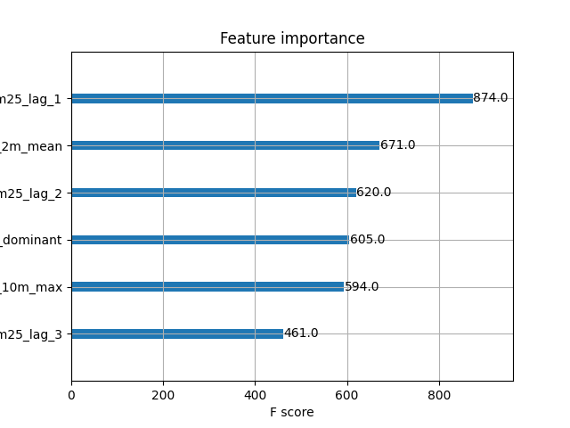
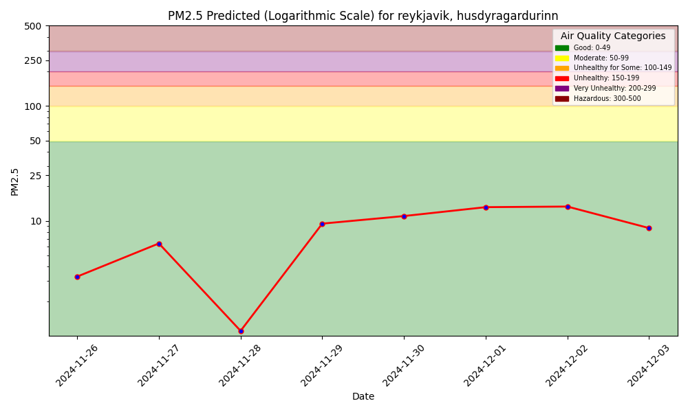
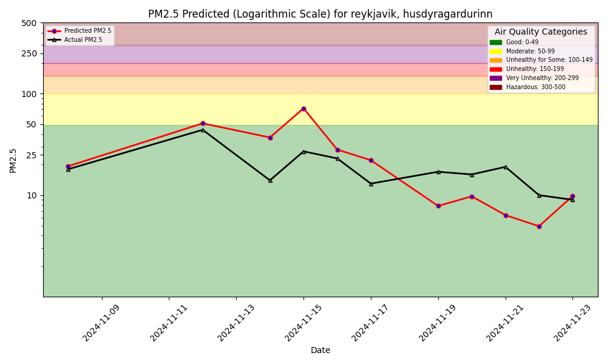

# LAB1 - Air Quality Prediction Service
## ID2223 KTH - Group 0
> Ísak Arnar Kolbeins and Esha Bilal

A dashboard that predicts the air quality (PM2.5) for the next 7-10 days

### Location
Húsdýragarðurinn, Reykjavík, Iceland 
"Reykjavíks zoo" 

### Backfill Feature pipeline
PM2.5 measurements and wether data from https://aqicn.org/historical/#city:iceland/husdyrag. loaded into 2 feature groups in Hopsworks.

Weather and Air Quality, the latter one has been updated to also keep track of the last 3 days pm25 measurements (as lag)

### Training Pipeline 
Selected features are: 
> *temperature_2m_mean, precipitation_sum, wind_speed_10m_max, wind_direction_10m_dominant, pm25_lag_1, pm25_lag_2, pm25_lag_3*

And the resulting feature importance is

## Daily updates
Are run with github actions, and run at 13:30 UTC daily

### Daily feature pipeline
Gets yesterdays wether and PM2.5 measurements along with next weeks wether forecast from the API https://api.waqi.info/feed/iceland/husdyrag
And updates the feature groups. 

### Daily batch inference pipeline
That makes the predictions for the next days and plots them in a dashboard and published on github pages https://isakkolbeins.github.io/id2223_lab1/air-quality/

Along with the graph of the models performance, where predictions are compared to actual measurements.

## The Current predictions

## The Model performance

***
***
***
***
***
#### The project based on O'Reilly book - Building Machine Learning Systems with a feature store: batch, real-time, and LLMs

and the repo is forked from https://github.com/featurestorebook/mlfs-book/
